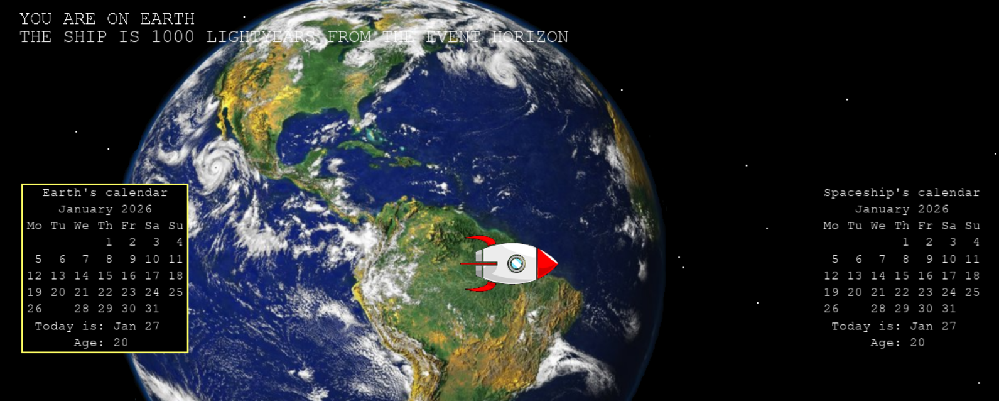

# Time Dilation Simulator

How does gravity affect the passage of time?

This project visualizes gravitational time dilation from general relativity. It lets you explore how proximity to massive objects changes how fast time passes for different observers.

In the simulation, there are two people:
- One person on **Earth**
- One person in a **spaceship**

Both start at age 20. Two calendars are displayed: one representing the date on Earth and one representing the date on the spaceship. As the spaceship moves through space, you can observe how the passage of time diverges between the two observers.

 

 

Use the left and right arrow keys to move the spaceship. Flying far enough to the right brings you closer to a black hole. As the ship approaches this massive object, gravitational effects increase and the two calendars begin to run at noticeably different rates. (Use the TAB key to toggle between Earth and spaceship perspectives.)

 

 

The goal is to provide an intuitive, visual way to experience one of the most fascinating predictions of general relativity: time itself slows down in strong gravitational fields.

## Motivation

Time dilation is often taught abstractly through equations and thought experiments. I wanted to build a visual, interactive model that lets users see how gravity affects time, making general relativity more approachable and intuitive.

### Features

- Two observers (Earth and spaceship) with synchronized starting ages
- Dual calendar display showing diverging timelines
- Keyboard-controlled spaceship movement
- Black hole region with strong gravitational time dilation
- Perspective toggle between Earth and ship (TAB key)
- Real-time visualization of relativistic effects

## Technologies

- Python
- Pygame
